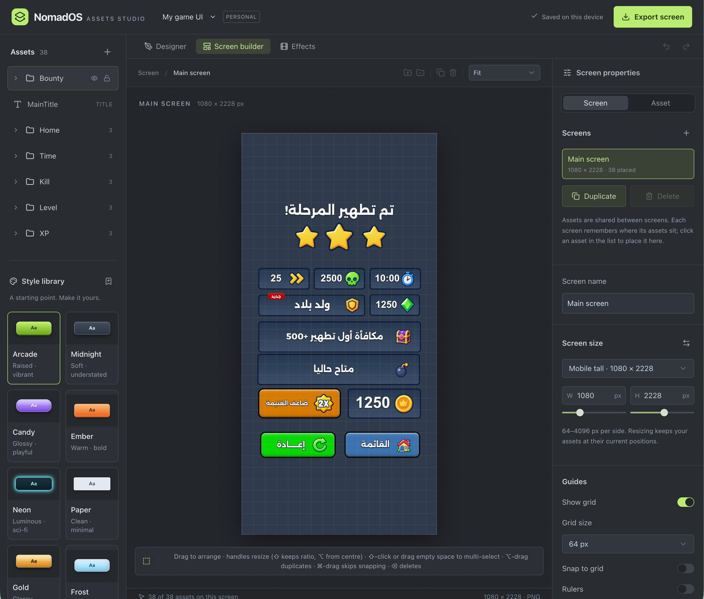
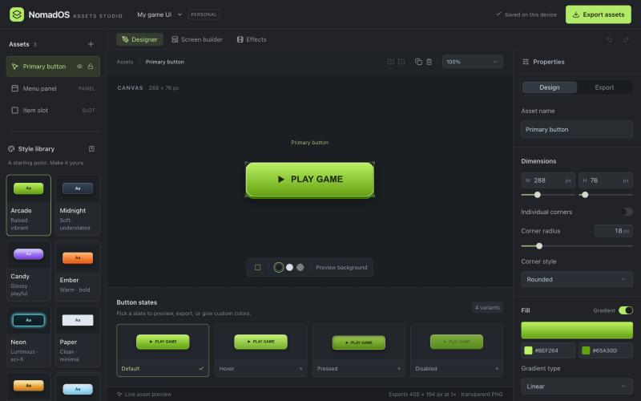
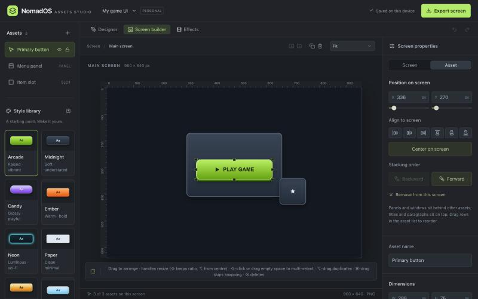

# NomadOS Assets Studio

A local-first, browser-based designer for game UI. Draw buttons, panels, bars, icons, and text, arrange them into screens, then export transparent PNGs with 9-slice borders and a Unity importer that builds the screens as prefabs.

Nothing leaves your machine. Projects autosave in your browser and export as plain `.uim.json` files you can keep anywhere.



*A 1080 × 2228 mobile screen with 38 assets in six folders, designed entirely in the app.*

## Run it

Requires Node.js 22.13 or later.

```sh
npm install
npm run dev
```

Open http://localhost:5173. Other scripts: `npm run build` and `npm run start` for a production build, `npm run typecheck`, `npm run lint`.

## What you can make

**Asset kinds.** Button, icon button, panel, window with a title band, hollow frame, speech bubble, slot, progress bar, segmented health bar, slider, toggle, checkbox, tab bar, badge, counter, icon, title, and paragraph.

**Looks.** Width and height, individual corner radii, rounded or chamfered corners, linear or radial gradients with extra colour stops, borders placed inside, centred, or outside, shadow and glow with their own colours, textures with opacity, scale, and tiling, a grain overlay, and a pixel-art mode. Seven surfaces: flat, raised 3D block, glossy sheen, chiseled bevel, embossed, engraved, and soft lighting, each with a highlight strength and a light angle.

**Text and icons.** System fonts or your own uploaded TTF, OTF, WOFF, or WOFF2 fonts saved inside the project, bold, uppercase, letter spacing, outline, and shadow. Nine tintable vector glyphs, a library of 43 full-colour game icons, and your own image uploads, each at its own size.

**States.** Buttons preview and export default, hover, pressed, and disabled. Each state can override fill, border, and text colours.

**Styles.** Eleven starting styles. Save your own, apply them to any asset, and update every linked asset at once.

**Effects.** Confetti, sparkles, and seamless floating backgrounds with deterministic playback, exported as PNG frames or sprite sheets with timing metadata.



## Build screens

Open **Screen builder**. A project holds several screens that share one asset library; each screen remembers where its assets sit. Click an asset in the list to place it on the current screen.

- Drag to move, drag the handles to resize. Shift keeps the aspect ratio, Option resizes from the centre.
- Shift-click or drag across empty space to select several assets. Align within the selection, space three or more evenly, or centre on the screen.
- Assets snap to the screen edges and centre, to each other, and to an optional grid, with dashed guides. Hold Shift to lock an axis, Option to drag out duplicates, and ⌘ (Ctrl) to skip snapping.
- Fold assets into folders with ⌘G, like Photoshop layer groups. A folder collapses, renames, selects as a whole, hides, locks, reorders, and duplicates with everything inside.
- Lock and hide per asset, rulers, a grid with snap-to-grid, and an outline toggle (O) when the selection frame gets in the way.
- Panels and windows always draw behind other assets; titles, paragraphs, and icons draw on top. Drag rows in the list to change the order in between.

**Export screen** saves a flattened PNG of the current screen, and **Export all screens** saves one per screen.



## Export to Unity

1. In **Designer**, open the **Export** tab, choose **Entire asset kit · ZIP** and a scale (1×, 2×, or 4×), then download. A 2× or 4× pack keeps the same on-screen size in Unity because pixels per unit scale with it.
2. Extract the folder under your Unity project's `Assets`. Keep `Editor/UIMAssetImporter.cs` inside an `Editor` folder.
3. Select `uim-manifest.json` and choose **Tools → UIM Studio → Apply sprite settings**. Every PNG becomes a sprite with the right pixels per unit, alpha, and 9-slice border.
4. Choose **Tools → UIM Studio → Build screen prefabs**. You get one prefab per screen: an Image per asset at its exact position and size, sliced where borders exist, buttons wired with Sprite Swap states, titles and paragraphs as editable text (TextMeshPro when installed, otherwise UI Text), and folders as parent objects.
5. Drop a prefab into a Canvas whose scaler uses your screen size as the reference resolution. Game logic stays in Unity.

Export without text and icons for backgrounds you will stretch; baked lettering stretches with the sprite. The **Stretch preview** in the Export tab shows how an asset will look at another size with its protected border. Uploaded fonts are not included in the ZIP; copy the font file into Unity and assign it to the text components.

## Saving

Use the project menu beside the logo to rename, save, open, or start a project. Browser saves belong to this browser and site origin and do not sync between devices. Download a project file for backups or to move between machines. Starting a new project can be undone.

## Keyboard shortcuts

| Keys | Action |
| --- | --- |
| ⌘Z, ⌘⇧Z | Undo, redo |
| ⌘D | Duplicate the selection, folders included |
| ⌘C, ⌘V | Copy and paste assets |
| ⌘A | Select everything on the screen |
| ⌘G, ⌘⇧G | Group into a folder, ungroup |
| Delete, Backspace | Remove the selection |
| Esc | Back to screen settings |
| Arrows, Shift+Arrows | Nudge by 1 px or 10 px |
| O | Show or hide the selection outline |

On Windows and Linux use Ctrl for ⌘ and Alt for Option.

## Project structure

- `components/studio-app.tsx`: editor state, selection, folders, screens, project actions, save and load.
- `components/design-inspector.tsx`: appearance controls.
- `components/scene-preview.tsx`: the screen canvas with handles, snapping, marquee, rulers, and grid.
- `components/screen-inspector.tsx`: screens, guides, background, and screen export.
- `components/export-options.tsx`: export settings and the stretch preview.
- `components/effect-workspace.tsx`: animation preview and controls.
- `lib/studio.ts`: the design model and the shared canvas renderer.
- `lib/screen.ts`: screen model, placements, snapping, and the screen renderer.
- `lib/project.ts`: project schema, migration, and IndexedDB persistence.
- `lib/exports.ts`, `lib/zip.ts`: export packs and ZIP creation.
- `lib/effects.ts`: deterministic animation renderer.
- `lib/icon-library.ts`, `public/icons`: the built-in game icons.
- `public/UIMAssetImporter.cs`: the Unity Editor helper.
- `tests/`: browser verification components that can be mounted on a local route.

Built with React, TypeScript, Vite through vinext, Canvas 2D, and shadcn primitives. There is no server, account, or telemetry.

## License

MIT, see `LICENSE`. The game icons in `public/icons` were made for this project and ship under the same license.
